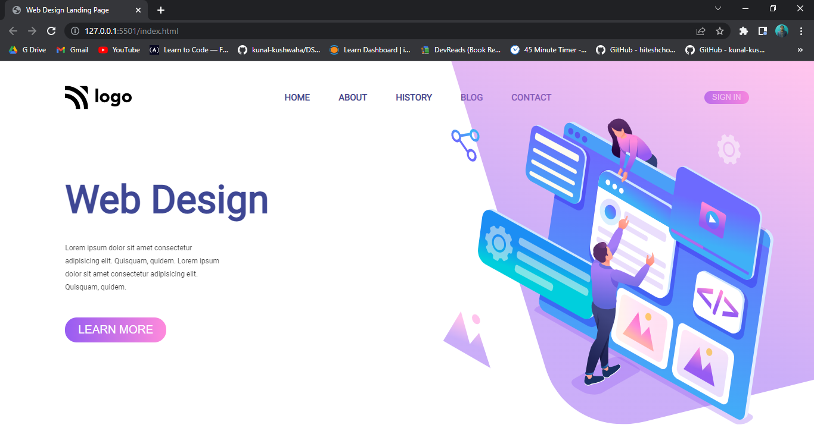
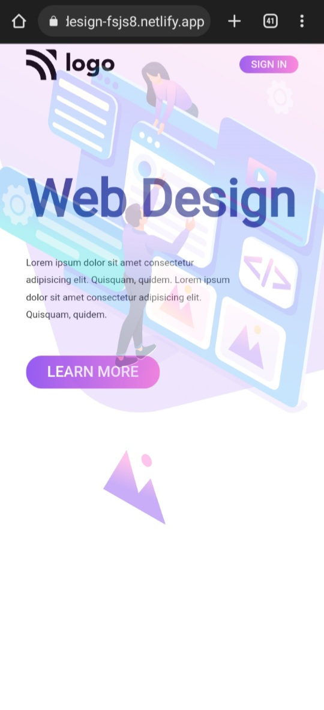

# Web Design Landing Page

Hi 👋 I am Shobhan Sundar Goutam. This project is made with the help of `HTML` and `CSS`.

 

### Screenshot

### Screenshot

- ### Learnings from this project:-

  - Learned to use `absolute` property of CSS positions.
  - Learned to use both flexbox and grid.
  - Learned to make responsive with css.

- It took around _3 hours_ to complete.

- Live Link:- [Web Design Landing Page](https://webdesign-fsjs8.netlify.app/)
